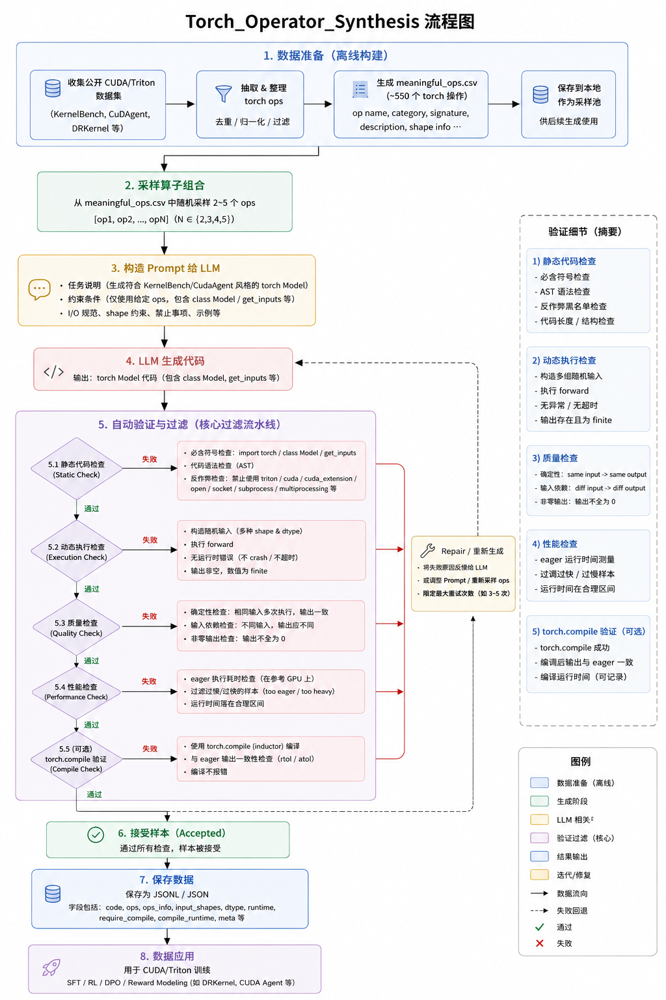

# Torch_Operator_Synthesis


基于torch操作生成Model。目前kernel生成开源的数据比较少，我们可以通过torch model来合成cuda/triton数据，以供SFT/RL使用。

目前调研到的一些数据：
- https://huggingface.co/datasets/SakanaAI/AI-CUDA-Engineer-Archive
- https://huggingface.co/datasets/BytedTsinghua-SIA/CUDA-Agent-Ops-6K
- https://huggingface.co/datasets/ByteDance-Seed/cudaLLM-data
- https://huggingface.co/datasets/hkust-nlp/drkernel-coldstart-8k
- https://huggingface.co/datasets/hkust-nlp/drkernel-rl-data

基于这些数据，我们可以把torch的一些算子提取出来，并生成相关的Model。

按照目前的一些论文：
- CudaAgent：Large-Scale Agentic RL for High-Performance CUDA Kernel Generation
- DRKernel：Reinforcement Learning Done Right for Triton Kernel Generations
- StitchCUDA：An Automated Multi-Agents End-to-End GPU Programing Framework with Rubric-based Agentic Reinforcement Learning
- Kernel-Smith: A Unified Recipe for Evolutionary Kernel Optimization

以及KernnelBench，使用的基础的torch Model格式为：
```python
import torch
import torch.nn as nn
import torch.nn.functional as F


class Model(nn.Module):

    def __init__(self):
        super().__init__()
        self.maxpool2d = nn.MaxPool2d(kernel_size=4, stride=4)
        self.fractional_maxpool = nn.FractionalMaxPool2d(
            kernel_size=2, output_size=(32, 32)
        )

    def forward(self, x):
        torch.manual_seed(0)
        x = self.maxpool2d(x)
        x = self.fractional_maxpool(x)
        x = torch.fft.fft2(x)
        x = torch.abs(x)
        batch, channels, h, w = x.shape
        x = x.view(batch, channels, h * w)
        x, indices = F.max_pool1d_with_indices(x, kernel_size=4, stride=4)
        x = torch.tile(x, (1, 2, 1))
        return x


def get_init_inputs():
    return ()

def get_inputs():
    batch_size = 32
    channels = 64
    height = 256
    width = 256
    x = torch.randn(batch_size, channels, height, width)
    return (x,)

```
我们生成的数据格式也应该是这样。

# torch 操作获取
这里我们已经获取到了550个torch操作，见ops_catalog/meaningful_ops.csv，其中包括torch.nn、torch.nn.functional、torch.matmul等等，可以直接使用。过滤掉以下算子：
- torch.float 等类型操作。
- torch.init 等初始化操作。

# torch model生成
可以使用任意的openai格式的接口，比如自己部署一个Qwen3-30B-A3B的模型：
```shell
model_path=/checkpoints/Qwen/Qwen3-30B-A3B-Instruct-2507
port=11384
vllm serve ${model_path} --host 0.0.0.0 --port ${port} --tensor-parallel-size 8 --gpu-memory-utilization 0.85 --enable-auto-tool-choice --tool-call-parser pythonic
```

```shell
python3 generate_cuda_agent_llm_data.py   \
--api-url http://192.168.11.18:11384/v1/chat/completions   \
--model /checkpoints/Qwen/Qwen3-30B-A3B-Instruct-2507  \
--meaningful-ops ops_catalog/meaningful_ops.csv   \
--output-dir data/llm_cuda_agent_ops   \
--count 6000   \
--max-tokens 16384   \
--repair-attempts 2   \
--workers 4   \
--require-compile   \
--resume \
--timeout 600
```

## 参数说明

| 参数 | 类型 | 默认值 | 说明 |
|------|------|--------|------|
| `--api-url` | str | `http://192.168.11.18:11384/v1/chat/completions` | LLM API 端点地址 |
| `--api-key-env` | str | `MINIMAX_API_KEY` | 环境变量名，用于获取 API Key |
| `--model` | str | `MiniMax-M2.5` | 使用的模型名称 |
| `--meaningful-ops` | str | `ops_catalog/meaningful_ops.csv` | torch 操作目录 CSV 文件路径 |
| `--output-dir` | str | `data/llm_cuda_agent_ops` | 输出目录 |
| `--count` | int | `6000` | 生成样本数量 |
| `--max-attempts` | int | `30000` | 最大尝试次数（防止无限循环） |
| `--min-ops` | int | `2` | 每个模型最少使用的操作数 |
| `--max-ops` | int | `5` | 每个模型最多使用的操作数 |
| `--seed` | int | `20260513` | 随机种子 |
| `--temperature` | float | `0.8` | LLM 采样温度 |
| `--max-tokens` | int | `16384` | LLM 最大生成 token 数 |
| `--timeout` | int | `240` | API 请求超时时间（秒） |
| `--repair-attempts` | int | `2` | 验证失败后的重试次数 |
| `--device` | str | `cuda` 或 `cpu` | 运行设备 |
| `--min-eager-ms` | float | `0.0` | 最小心跳时间（毫秒） |
| `--max-eager-ms` | float | `100.0` | 最大心跳时间（毫秒） |
| `--warmup` | int | `1` | 预热轮数 |
| `--repeat` | int | `3` | 验证重复次数 |
| `--atol` | float | `1e-2` | 绝对误差阈值 |
| `--rtol` | float | `1e-2` | 相对误差阈值 |
| `--require-compile` | flag | `False` | 是否要求通过 torch.compile 验证 |
| `--progress-every` | int | `10` | 每生成 N 个样本输出一次进度 |
| `--workers` | int | `1` | 并行工作进程数 |
| `--no-progress` | flag | `False` | 禁用进度输出 |
| `--resume` | flag | `False` | 断点续传模式 |

## 验证逻辑

生成后的模型会经过多轮验证，确保数据质量。主要验证步骤如下：

### 1. 静态代码检查

| 检查项 | 说明 |
|--------|------|
| 必含符号 | 代码必须包含 `import torch`、`class Model`、`get_inputs()`、`get_init_inputs()` |
| 反作弊检查 | 禁止使用 `triton`、`cuda_extension`、`load_inline`、`cpp_extension`、`requests`、`urllib`、`open`、`socket`、`subprocess`、`os.system` |
| 返回值检查 | 禁止直接返回 `torch.zeros`、`torch.ones`、`return 0`、`return None` |
| 输入规模检查 | 检查 batch_size、height、width、seq_len、in_features 等维度是否符合 CUDA 风格（batch≥16, H/W≥128, seq_len≥256, features≥128） |

### 2. 动态执行检查

| 检查项 | 说明 |
|--------|------|
| 执行成功 | `Model(*get_init_inputs())(*get_inputs())` 必须能正常运行 |
| 输出非空 | 输出 tensor 不能为空 |
| 有限值 | 输出不能包含 NaN 或 Inf |
| 确定性 | 相同输入必须产生相同输出（两次 forward 结果必须 close） |
| 非零输出 | 输出不能是全零常量 |
| 输入依赖 | 不同输入必须产生不同输出（避免生成常数） |

### 3. 性能检查

| 检查项 | 说明 |
|--------|------|
| 运行时间 | eager 模式运行时间必须在 `--min-eager-ms` 和 `--max-eager-ms` 之间（默认 0.1ms - 100ms） |
| torch.compile（可选） | 如果开启 `--require-compile`，还需验证编译后输出与 eager 输出一致 |

### 验证失败原因

| 原因 | 说明 |
|------|------|
| `cheating_or_forbidden_api` | 使用了禁止的 API |
| `execution_failed` | 代码执行失败 |
| `empty_output` | 输出为空 |
| `non_finite_output` | 输出包含 NaN/Inf |
| `stochastic_output` | 相同输入产生不同结果 |
| `zero_output` | 输出全为零 |
| `constant_or_input_indistinguishable_output` | 输出与输入无关 |
| `too_eager` | 运行时间过短（太简单） |
| `too_heavy` | 运行时间过长（太重） |
| `compile_output_mismatch` | torch.compile 输出不匹配 |

## 生成数据样例

```json
{
  "attempt": 2,
  "ops": ["F.glu", "nn.EmbeddingBag"],
  "requested_ops": [
    "torch.nn.functional.glu",
    "torch.nn.EmbeddingBag"
  ],
  "repair_round": 0,
  "data_source": "llm_cuda_agent#2",
  "code": "import torch\nimport torch.nn as nn\nimport torch.nn.functional as F\n\nclass Model(nn.Module):\n    def __init__(self, num_embeddings: int, embedding_dim: int, hidden_dim: int):\n        super().__init__()\n        self.embeddingbag = nn.EmbeddingBag(num_embeddings, embedding_dim, mode='mean')\n        self.fc = nn.Linear(embedding_dim, hidden_dim * 2)\n        self.out_proj = nn.Linear(hidden_dim, hidden_dim)\n\n    def forward(self, input_ids: torch.Tensor) -> torch.Tensor:\n        emb = self.embeddingbag(input_ids)\n        hidden = self.fc(emb)\n        gated = F.glu(hidden, dim=-1)\n        out = self.out_proj(gated)\n        out = torch.tanh(out)\n        return out\n\ndef get_init_inputs():\n    return (100000, 256, 512)\n\ndef get_inputs():\n    batch_size = 128\n    seq_len = 1024\n    num_embeddings = 100000\n    input_ids = torch.randint(0, num_embeddings, (batch_size, seq_len), dtype=torch.long)\n    return (input_ids,)",
  "filter": {
    "reason": "accepted",
    "cheat_check": {
      "passed": true,
      "hits": {}
    },
    "shape_scale_check": {
      "passed": true,
      "values": {},
      "warnings": []
    },
    "checks": {
      "required_symbols": true,
      "no_cheating": true,
      "setup": true,
      "eager_forward": true,
      "finite_nonempty": true,
      "deterministic_same_input": true,
      "nonzero_output": true,
      "input_dependent": true,
      "eager_runtime": true,
      "torch_compile": true
    },
    "output_shape": [128, 512],
    "output_dtype": "torch.float32",
    "eager_ms": 0.687,
    "compile_ms": 0.699,
    "compile_matches_eager": true
  }
}
```

```
@misc{TOS,
  author = {Oubo Gong},
  title = {TOS: Torch Operator Synthesis},
  year = {2026},
  publisher = {GitHub},
  journal = {GitHub repository},
  url="https://github.com/taishan1994/Torch_Operator_Synthesis",
}
```
